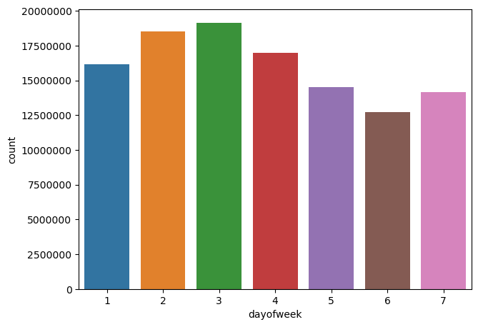
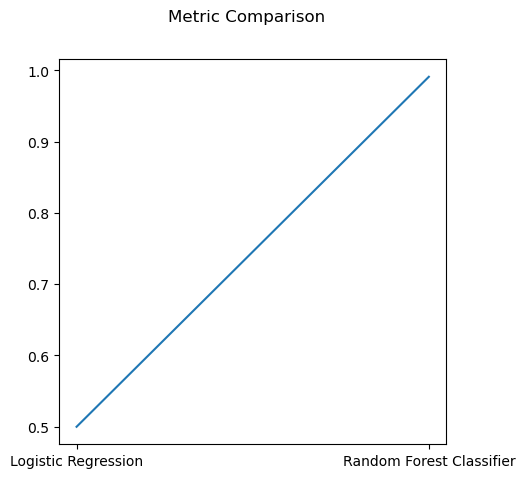

# Big Data Project

The requirements and the description of the dataset are [here](dataset-and-requirements.md).

## Executive Summary
What are **Advertisements**? How do Internet advertisements work? **Internet advertising** is a tool used to deliver promotional messages to people around the world, using the Internet as a global marketing platform. There are many ways you can advertise on the internet, an advertiser can post ads for free or advertisers pay publishers different amounts for impressions and clicks for ad inventory on their pages based on the value of that space to the advertiser. The dataset was extracted from an online advertising company's systems. The data consists of various attributes such as the title of the ad, parameters used by a user to search for the ad displayed, timestamp of the ad, if an ad was clicked or not, and many more. As you go through you would find **exploratory data analysis** for the data, also some predictions using different modeling techniques such as **Logistic Regression, Random Forest Classifier** for whether an ad has been clicked or not.This model will be helpful for an advertiser to test whether his/her ad will be clicked or not, suggesting to improve their features so that the ad reaches the customer.

Keywords: Exploratory data analysis, Logistic Regression, Random Forest Classifier.

## Data Sourcing
Data is available on two sources :
* AWS: **s3://bigdatateaching/project-data/**
* Azure: **wasbs://public@bigdatateaching.blob.core.windows.net**

I used both sources as per my requirement.

**NOTE**: While using Azure Databricks, the data has to be mounted from the above-mentioned location to dbfs.

## Data Ingestion
Since data is available on different sources, the data has been taken from those as **Spark Dataframes** to perform analysis.

## Data Cleaning and Preparation 
* There are various ways and means used to clean and prepare data for analysis. Firstly, the primary table is search_click, which played an important role during data analysis. Also, there are several links between all the tables which are linked with different keys which have been used to join the tables as per the analysis required. Tables have been linked using
  1. AdID
  2. UserID
  3. LocationID
  4. CategoryID

* Analysis has been done based on two types of ads 
  1. Contextual Ads
  2. Non-Contextual Ads

* They have been distinguished using the IsClick column,
  * All the rows with 'IsClick' **0** or **1** are contextual ads.
  * All the rows with 'IsClick' **NULL** are non-contextual ads.

* For visualizations, data frames have been converted into pandas data frames from spark data frames.

## Tools Used
 1. **AWS**
 2. **Azure**
 3. **Spark**
 4. **Pandas**
 5. **Matplotlib**
 6. **Seaborn**

## Models Used
 1. **Logistic Regression**
 2. **Random Forest Classifier**

## Hypothesis 
* Based on the information given, it can be inferred that IsClick is applicable only for Contextual data and the location of the ad plays a great role in deciding whether an ad is clicked or not.
* Also, **Random forest Classifier** would be more efficient in predicting the target as it implicitly handles the collinearity in the features.

## Visualizations
* #### Pie Chart for concentration of type of ads 
- This analysis is to check how the types of ads are distributed in the dataset.
 

* #### Bar Chart for Avg(price) for each Region
- This analysis is to check if price varies by the region the ad was posted.
- From the graph it can be inferred that region plays a pivotal role.
 

* #### Bar Chart for Avg(price) for each Level of Location(Region,City)
- This analysis is to check which if CityID or RegionID are more useful as feature.
 

* #### Bar Chart for no. of searches per day (Starting from Sunday with 1 to Saturday with 7)
- This analysis is to check whether the day of week is effecting the searches by users.
 

## Challenges (technical & non-technical)
 * Technical 
   - Working on a large dataset has been a challenge as to load and perform operations.
   - Visualizing the data had to be done through pandas data frame and converting it into a pandas data frame was a challenge as well.
   - Understanding the data and selecting the appropriate model. 
   - Collecting meaningful features.

 * Non-Technical
   - Setting up an AWS environment for the project from scratch.
   - Running between Azure and AWS for various reasons.

## Results/Conclusions:
- It can be concluded that there are certain features which decide whether an ad will be clicked or not by a user.Hence, the model is efficient is predicting such with great accuracy.
- Also, the Random Forest classifier is a perfect model for this data. It shows an accuracy of 0.99 when the model has been evaluated. Whereas, logistic regression only shows an accuracy of 0.5 implying that it is loosely suitable for such data.

-  

## Learning
- Working with the project has firstly built great confidence that handling big data is not an impossible task, though it requires strong knowledge in SQL, Machine Learning, Data Analysis, etc.
- I did learn a lot of new things such as,
    1. Setup and Error Handling in AWS and Azure.
    2. How big data affects various python libraries.
    3. Calculated usage of resources provided.
    4. Creating a Data Strategy.

## Future improvements
- Extracting more attributes, selecting more meaningful features, and evaluating using different patterns.
- Using AWS and Azure resources more wisely.

## Takeaways from the course
- Operating big data tools such as Spark, Hadoop, Dask, MapReduce etc.
- Setting up big data tools on AWS and Microsoft Azure.
- Ingestion, Wrangling, Cleaning, Analyzing, and Storing Big data.

## Code files 
* finalproject.ipynb